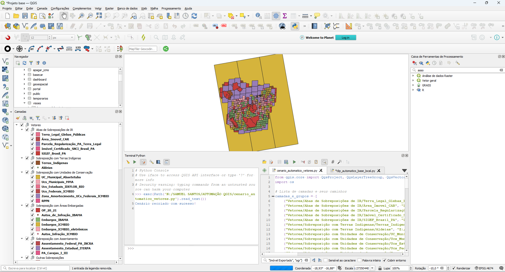
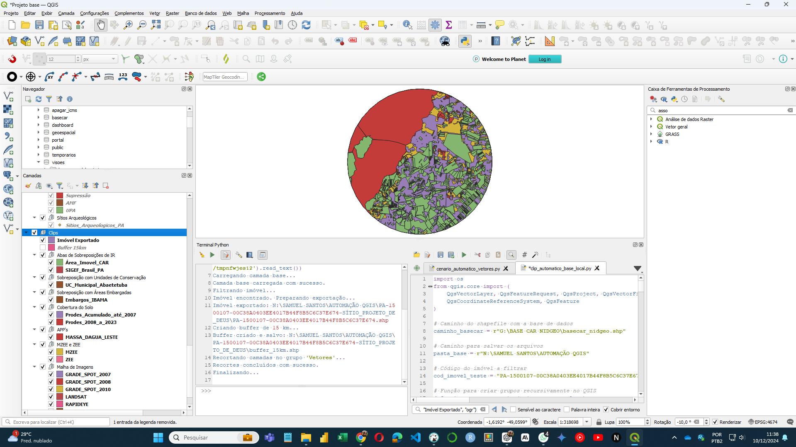
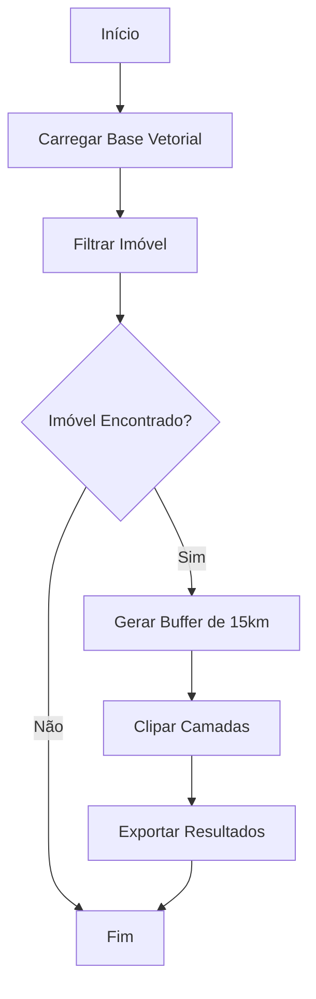

# **1. Resumo Executivo**

### **Título do Projeto: Automação de Cenários Geoespaciais no QGIS**
**Autor:** [Samuel da Costa dos Santos](https://github.com/samuel-c-santos)  
**Data:** 10/12/2024  
**Versão:** 1.0  

---

## **1.1. Breve descrição do sistema e sua finalidade**
Este projeto consiste em dois scripts Python desenvolvidos para a automação do processo de geração de cenários geoespaciais no QGIS, utilizados pela **GTDI (Gerência de Tratamento Digital de Imagens e Suporte ao Monitoramento Espacial Ambiental)**, da **DIGEO (Diretoria de Geotecnologias da Secretaria de Estado de Meio Ambiente)**.  

A solução substitui tarefas manuais como importação de dados vetoriais, organização em grupos e subgrupos, criação de buffers e recortes específicos, liberando a equipe para focar em análises mais complexas e estratégicas.

---

## **1.2. Objetivo principal**
Automatizar o processo de montagem e recorte de cenários geoespaciais no QGIS para análises ambientais e de licenciamento, reduzindo o tempo e o esforço necessário para tarefas repetitivas e otimizando a operação da equipe da GTDI.

---

# **2. Introdução**
A equipe da GTDI é responsável por preparar cenários geoespaciais que subsidiam a análise de solicitações de Cadastro Ambiental Rural (CAR) e licenciamentos ambientais no Pará. Este trabalho envolve:

- Importação de diversas camadas vetoriais relacionadas a zoneamento, áreas protegidas, assentamentos, infrações ambientais, entre outros.  
- Organização hierárquica em grupos e subgrupos no QGIS.  
- Criação de buffers (15 km) ao redor de áreas de interesse e recorte de camadas para análise local.  

Os scripts automatizam essas etapas no QGIS, usando um arquivo base local de dados vetoriais ou uma lista predefinida de camadas armazenadas em um servidor institucional.

---

# **3. Arquitetura e Tecnologias Utilizadas**

- **Editor de Python do QGIS:** Ferramenta utilizada para desenvolver e executar os scripts.  
- **Python:** Linguagem base para automação das tarefas geoespaciais.  
- **QGIS APIs:** Manipulação de camadas, criação de buffers, recorte de feições e organização de projetos.  
- **Estruturas de Dados Vetoriais:** Arquivos `.shp` utilizados para entrada e saída de dados.  

---

## **3.1. Fluxo de Operação e Funcionalidades Principais**
### **Scripts**
1. **cenario_automatico_vetores.py**  
   - Carrega uma lista de camadas pré-definidas do servidor.
   - Organiza em grupos e subgrupos no projeto QGIS.  
   - Facilita a criação inicial do cenário geoespacial.  

2. **clip_automatico_base_local.py**  
   - Filtra um imóvel específico a partir de uma base vetorial local.  
   - Cria buffers (15 km) e realiza recortes automáticos nas camadas.  
   - Organiza e salva os dados em estrutura de pastas.  

---

# **4. Fluxo de Uso e Interface**

1. Execute os scripts no editor de Python do QGIS.
2. O **cenario_automatico_vetores.py** organiza todas as camadas de interesse em grupos e subgrupos.  
3. O **clip_automatico_base_local.py** realiza o recorte das camadas com base no buffer ao redor do imóvel filtrado.

---

## **4.1. Capturas de Tela das Interfaces Principais**

**Cenário Inicial Gerado pelo cenario_automatico_vetores.py**  
  

**Recortes e Organização de Arquivos do clip_automatico_base_local.py**  
  

---

# **5. Estrutura de Diretórios**
```
📁 Projeto QGIS Automatizado
├── 📁 Vetores
│   ├── Abas de Sobreposições de IR
│   ├── Sobreposição com Terras Indígenas
│   ├── Sobreposição com Unidades de Conservação
│   ├── Cobertura do Solo
│   ├── ...
├── 📁 Clips
│   ├── Buffer_15km
│   ├── Área_Imovel_CAR
│   ├── Terras_Indígenas
│   └── ...
```

---

# **6. Testes Realizados**
Os scripts foram testados em:
- QGIS versão 3.28 ou superior.  
- Cenários com mais de 50 camadas vetoriais.  
- Arquivos locais e camadas remotas.  

---

# **7. Implantação e Acesso**
1. Clone o repositório:  
   ```bash
   git clone https://github.com/nidgeo-digeo-semas/cenario_automatizado_qgis.git
   ```
2. Configure o QGIS para execução de scripts Python.  
3. Execute os arquivos `.py` no editor Python do QGIS.

---

# **8. Licença**
Este projeto está licenciado sob a [MIT License](LICENSE).

---

# **9. Manutenção e Atualizações Futuras**
- Integração com bancos de dados espaciais PostgreSQL/PostGIS.  
- Suporte a múltiplos buffers em uma única execução.  
- Interface gráfica no QGIS para configuração dinâmica de cenários.  

---

# **10. Conclusão**
Este projeto demonstra o impacto da automação no processamento de dados geoespaciais, otimizando o fluxo de trabalho da equipe da GTDI e promovendo análises mais ágeis e precisas.  

---

# **11. Fluxogramas**

O fluxograma abaixo descreve o fluxo de operação do sistema:



Também acessível em html:
[Fluxograma Interativo](fluxograma_interativo.html)

---
